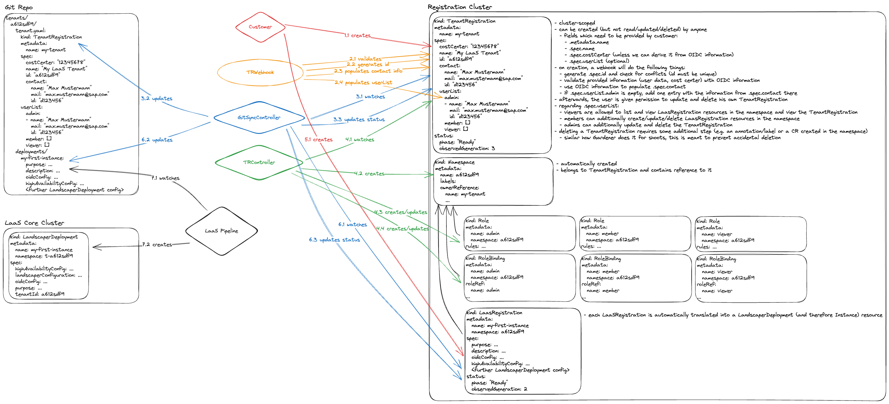

# LaaS Onboarding System (LOS)

Goal: To have a fully automated onboarding system, which allows (authenticated) users to request Landscaper instances.

## Concept

## Components

### TenantRegistrationWebhook

This is a mutating webhook which has the following tasks:
- on creation
  - fill in primary contact based on auth information from the OIDC request
  - generate tenant id and check for conflicts (existing namespaces in the cluster)
  - if no userlist is specified, the primary contact is used as admin
- on update
  - ensure that tenant id is not modified
  - ensure that only admins can modify the resource
  - ensure that the primary contact is not changed (requires ticket?)
  - ensure that the primary contact is not removed from admins?
- on deletion
  - safeguard against accidental deletion
    - only allow deletion if a special annotation/CR/whatever is present

Not sure if we can do this with a single mutating webhook or if an additional validating webhook is required or would be better.

### GitSyncController

This controller watches `TenantRegistration` and `LaaSRegistration` resources and fulfills the following tasks:
- for TenantRegistrations
  - when a TR is created or updated, the change is persisted by syncing the TR into a git repository
    - basically, the whole manifest (without `.metadata`, except for `.metadata.name`, and without `.status) is dumped into the repo
      - this allows for easy restoration in case the TRs in the cluster are lost for some reason
    - the current state of the sync is reflected via the TR's `.status.phase` and `.status.observedGeneration` fields
- for LaaSRegistrations
  - when a LR is created or updated, the spec of the resource is synced into a git repository
    - the current state of the sync is reflected via the LR's `.status.phase` and `.status.observedGeneration` fields

### TenantRegistrationController

The TRC is responsible for setting up the tenant namespaces. It watches TenantRegistrations and reacts as follows:
- on creation / on update when the state shows that the version has not been synced to git yet
  - don't do anything, as the tenant has to be synced to the git repo first
- on update when the sync is completed
  - check if a namespace for the TR exists and create it, if not
  - also create a Role and RoleBinding which allows all users listet in the TR's userlist to handle LRs in the namespace according to their roles
